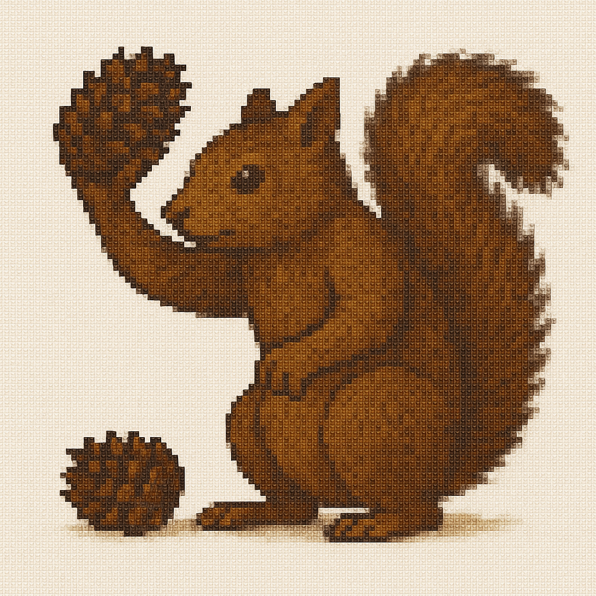
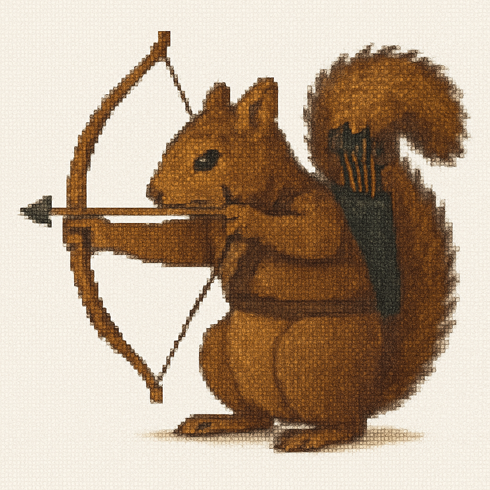
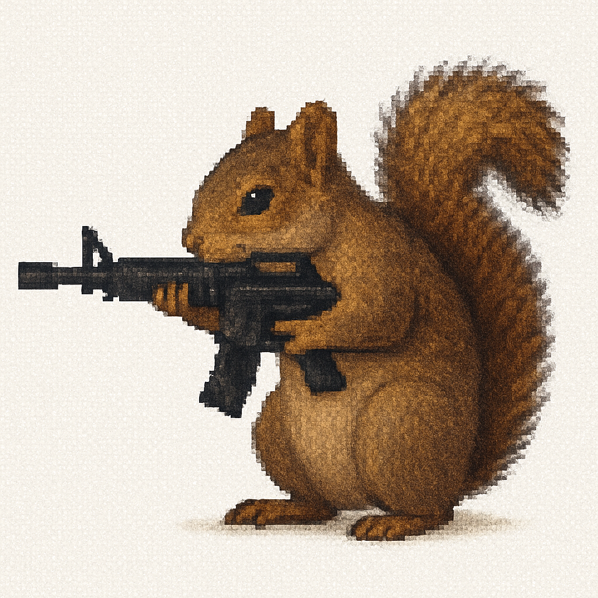

# Squirrels Tower Defense!

Welcome to Squirrels Tower Defense, A parody of the Bloons Tower Defense Series.

# Rules

You are a squirrel, and the humans are trying to burn down your forest, so as retaliation, you
will fight back using your army of squirrels fueled by acorns dropped from the slain humans.
As the game progresses, more and more humans will continue arriving in the forest, leading to
more acorns, more squirrels, and more chaos.

In short, purchase specialized squirrels from fallen humans to defend the forest.

# Towers

Meet the Specialized Soldier Squirrels!

CONETHROWER

- The most basic of squirrels, only costing 50 acorns to hire
- Attacks one human, while dealing one damage per throw

ARCHER

- An evolution of the Conethrower, costing 80 acorns to hire
- Attacks all humans in its firing range, dealing one damage to each human

ASSAULT

- The pinnacle of the squirrel combat force, costing a hefty 200 acorns to hire
- Attacks and kills all humans within its radius instantly
